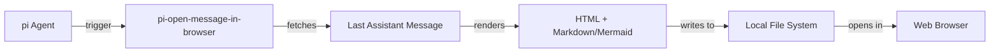

# pi-open-message-in-browser

Pi extension to open the last assistant message in a browser with Github flavor markdown preview and Mermaid support.

## ❓ The Problem

Reading a wall of markdown text in terminal is not a great experience. Better way is to open that in a browser with markdown and mermaid support

## 🛠️ Installation

To install this tool using `pi`, run:

```bash
pi install npm:pi-open-message-in-browser
```

## 📖 Usage
```
/open-message-in-browser
# To change settings - browser and file path
/open-message-in-browser:settings
```
## 🏗️ How it works



## 🤝 Contributing

Contributions are welcome! Please feel free to submit a Pull Request.

## 📜 License

This project is licensed under the MIT License.
