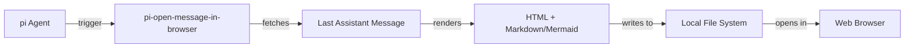

# pi-open-message-in-browser

Pi extension to open the last assistant message in a browser with Github flavor markdown preview and Mermaid support.

## ❓ The Problem

Reading a wall of markdown text in terminal is not a great experience. Better way is to open that in a browser with markdown and mermaid support

## 🛠️ Installation

To install this tool using `pi`, run:

```bash
pi install npm:pi-open-message-in-browser
```

## 📖 Usage
```
/open-message-in-browser
# To change settings - browser, file path, and theme (light/dark/auto)
/open-message-in-browser:settings
```

By default, the exported page uses the **light** GitHub theme regardless of your
OS/browser color-scheme preference. Choose `dark` to always force dark, or `auto`
to follow the browser's `prefers-color-scheme` setting instead.

## 💻 Standalone CLI

This package also ships a `mdopen` CLI that converts any Markdown file to
GitHub-flavored HTML (with Mermaid support) and opens it in a browser — no `pi`
agent required.

### Install

```bash
npm install -g pi-open-message-in-browser
```

This adds the `mdopen` command to your `PATH`.

### Usage

```bash
mdopen <file.md> [options]
```

Options:

| Flag | Description | Default |
| --- | --- | --- |
| `-t, --theme <light\|dark\|auto>` | Theme to render with | `light` |
| `-o, --out <file.html>` | Write HTML to this path instead of a temp file | temp file |
| `-b, --browser <command>` | Command used to open the file | `open` (macOS) / `xdg-open` (Linux) |
| `-n, --no-open` | Convert only, don't open a browser | opens by default |
| `-h, --help` | Show help | |

Examples:

```bash
mdopen README.md                       # open with light theme
mdopen notes.md --theme dark           # force dark theme
mdopen notes.md --out notes.html -n    # just convert, don't open
```
## 🏗️ How it works



## 🤝 Contributing

Contributions are welcome! Please feel free to submit a Pull Request.

## 📜 License

This project is licensed under the MIT License.
