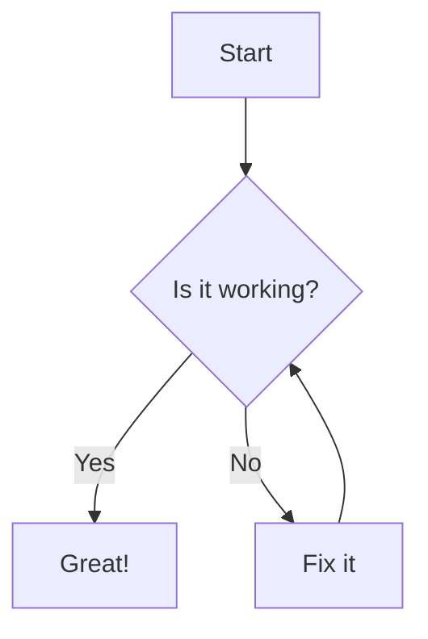
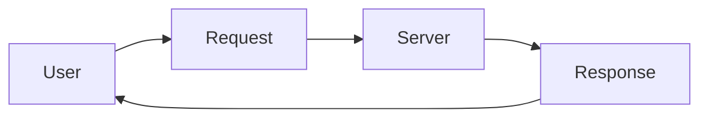
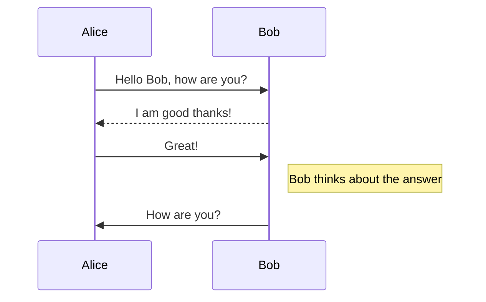
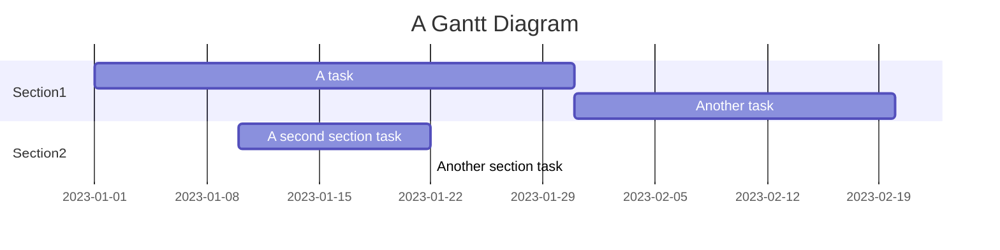
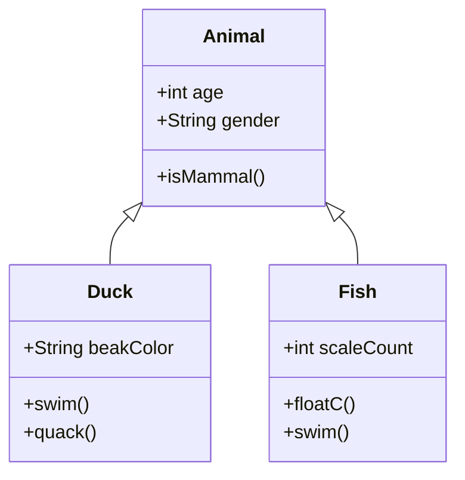
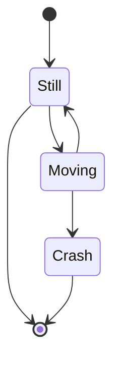
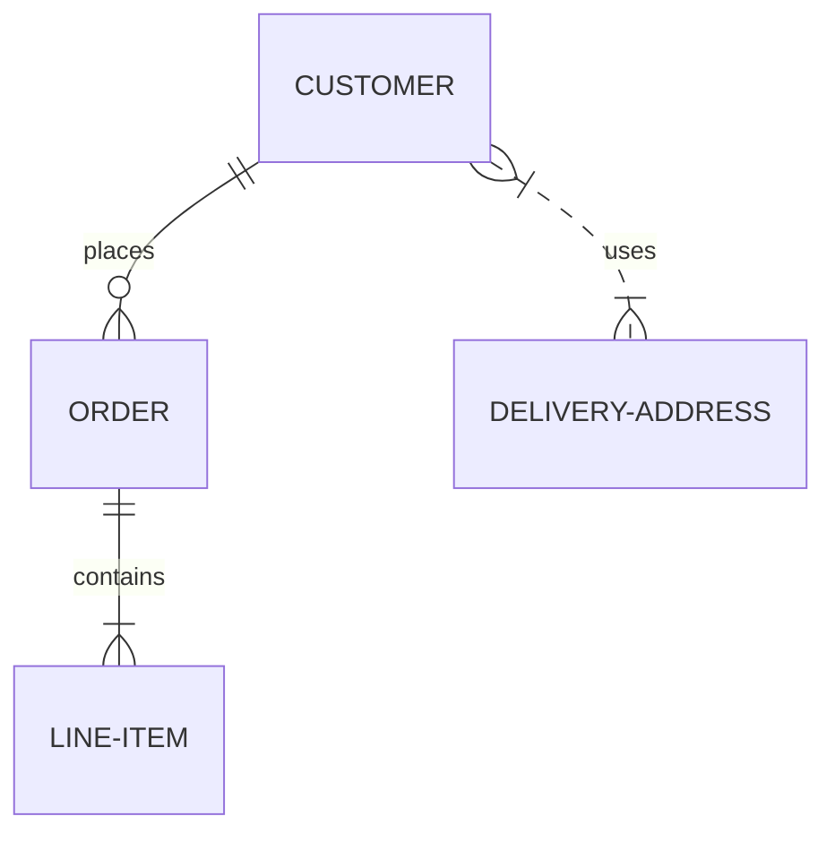
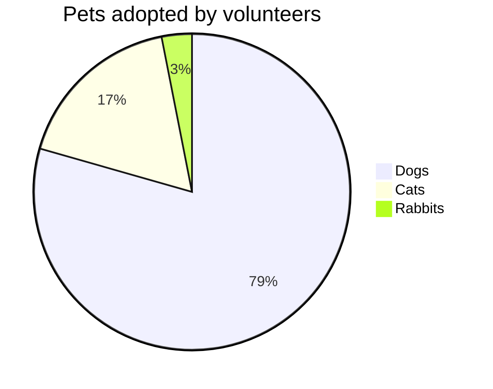
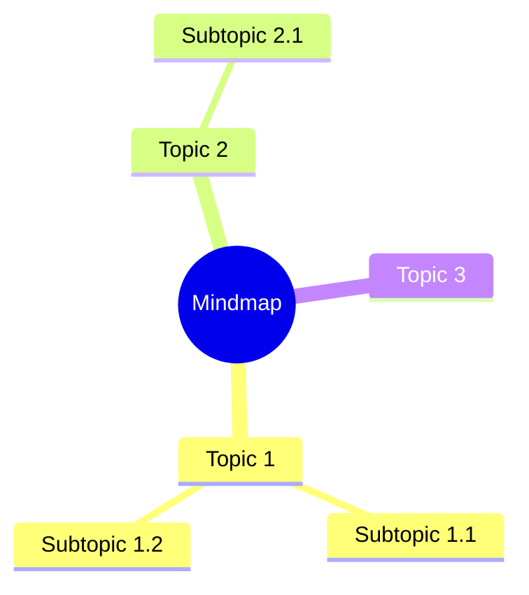
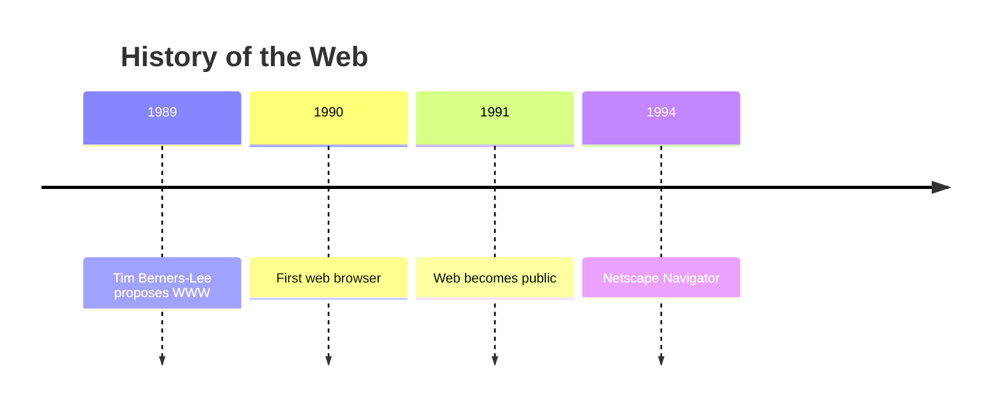

# Mermaid Gallery

This page contains examples of all supported Mermaid diagram types for visual regression testing.

## Flowchart (TD)

## Flowchart (LR)

## Sequence Diagram

## Gantt Chart

## Class Diagram

## State Diagram

## Entity Relationship Diagram

## Pie Chart

## Mindmap

## Timeline

