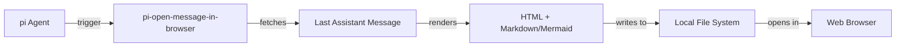

# pi-open-message-in-browser

Pi extension to open the last assistant message in a browser with Github flavor markdown preview and Mermaid support.

## ❓ The Problem

Reading a wall of markdown text in terminal is not a great experience. Better way is to open that in a browser with markdown and mermaid support

## 🛠️ Installation

To install this tool using `pi`, run:

```bash
pi install npm:pi-open-message-in-browser
```

## 📖 Usage
```
/open-message-in-browser
# To change settings - browser, file path, and theme (light/dark/auto)
/open-message-in-browser:settings
```

By default, the exported page uses the **light** GitHub theme regardless of your
OS/browser color-scheme preference. Choose `dark` to always force dark, or `auto`
to follow the browser's `prefers-color-scheme` setting instead.

Code blocks are syntax-highlighted (via highlight.js) using a GitHub-matching theme.

## 🏗️ How it works



This package builds on top of [`mdopen`](../mdopen), which owns the actual
Markdown -> HTML conversion, asset loading, and browser-opening logic. This
package only adds the `pi` command registration and settings UI.

## 📜 License

This project is licensed under the MIT License.
