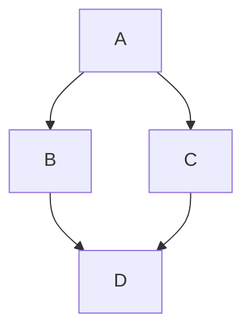

# Shiki Syntax Highlighting Test

This document tests the Shiki syntax highlighting migration.

## JavaScript

```javascript
function helloWorld() {
  console.log("Hello, World!");
  const x = 10;
  return x * 2;
}
```

## TypeScript

```typescript
interface User {
  name: string;
  age: number;
}

const user: User = {
  name: "Alice",
  age: 30
};
```

## Python

```python
def fibonacci(n: int) -> int:
    if n <= 1:
        return n
    return fibonacci(n - 1) + fibonacci(n - 2)
```

## Bash

```bash
#!/bin/bash
for i in {1..5}; do
  echo "Number: $i"
done
```

## HTML

```html
<!DOCTYPE html>
<html>
<head>
  <title>Test</title>
</head>
<body>
  <h1>Hello</h1>
</body>
</html>
```

## CSS

```css
body {
  background-color: #f0f0f0;
  font-family: sans-serif;
}

.container {
  max-width: 800px;
  margin: 0 auto;
}
```

## Rust

```rust
fn main() {
    println!("Hello, world!");
    let x = 5;
    let y = 10;
    println!("Sum: {}", x + y);
}
```

## Mermaid Diagram

