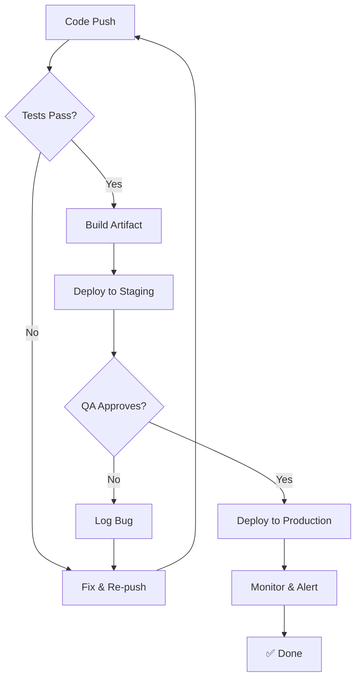
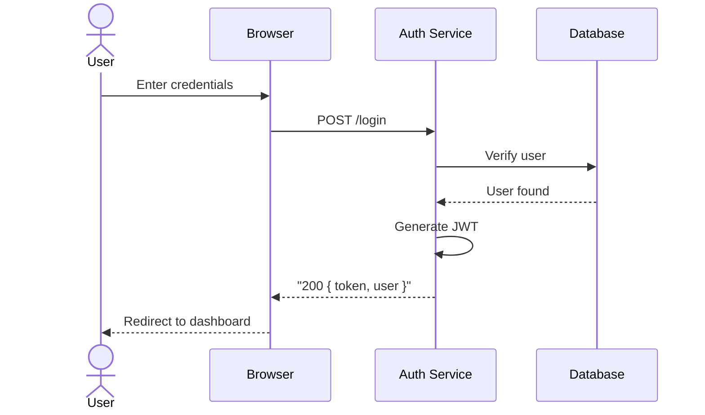
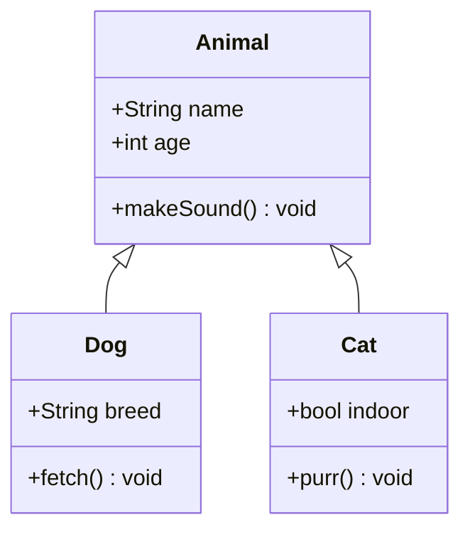

# Heading 1

## Heading 2

### Heading 3

#### Heading 4

##### Heading 5

###### Heading 6

---

**Bold text** and *Italic text* and ***Bold & Italic*** and ~~Strikethrough~~ and `inline code` and <sub>Subscript</sub> and <sup>Superscript</sup> and <ins>Underlined</ins> (via HTML).

---

> **Blockquote** — This is a blockquote. It can span multiple lines.
>
> > Nested blockquote inside another blockquote!
>
> And contain **other** inline *markdown*.

---

### Unordered List
- Item one
- Item two
  - Nested item A
  - Nested item B
- Item three

### Ordered List
1. First step
2. Second step
   1. Sub-step a
   2. Sub-step b
3. Third step

### Task List
- [x] Completed task
- [ ] Incomplete task
- [x] Another done task

### Definition List
Term A
: Definition for Term A — can include **inline** formatting.

Term B
: Definition for Term B.

---

### Link & Image
[Click here to visit GitHub](https://github.com)


---

### Code Blocks

Inline code: `const x = 42;`

Fenced block (JavaScript):
```javascript
// Fibonacci with memoization
const fib = (n, memo = {}) => {
  if (n in memo) return memo[n];
  if (n <= 2) return 1;
  memo[n] = fib(n - 1, memo) + fib(n - 2, memo);
  return memo[n];
};
console.log(fib(10)); // 55
```

Fenced block (no language):
```
Hello — this is a plain text code block.
No syntax highlighting.
```

---

### Table

| Syntax     | Description | Score |
|------------|-------------|-------|
| Heading    | Title       |   5   |
| Paragraph  | Text        |   3   |
| `code()`   | Function    |   9   |
| **Bold**   | Emphasis    |   4   |

Left-aligned | Center-aligned | Right-aligned
:- | :-: | -:
Left | Center | Right
Value | Pretty | Good

---

### Horizontal Rules

---

***

___

---

### Footnotes

Here's a sentence with a footnote.[^1]

Another sentence referencing the same footnote.[^1]

And a second footnote here.[^2]

[^1]: This is the first footnote — it explains something.
[^2]: Second footnote with a [link](https://example.com).

---

### HTML Elements (inline)

This is <span style="color: tomato;">red text</span> in a span.

<details>
<summary>Click to expand (collapsible section)</summary>

Hidden content revealed here — can contain **markdown**!

- List item
- Another item

</details>

<br/>

### Emoji / Shortcodes

:rocket: :fire: :+1: :100: :tada: :heart: :warning: :white_check_mark:

---

### Inline Math (if renderer supports it)

Euler's identity: $e^{i\pi} + 1 = 0$

Block math:

$$
\int_{a}^{b} f(x) \, dx = F(b) - F(a) \quad \text{where } F' = f
$$

---

## Mermaid Diagram

Here's a **flowchart** showing a CI/CD pipeline example:



And here's a **sequence diagram** for a login flow:



And a **class diagram** for good measure:


